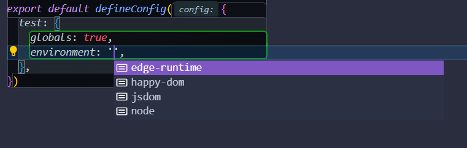
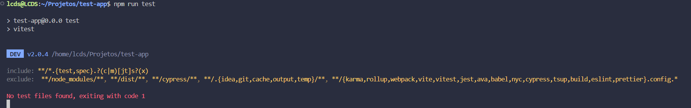

# 📚 Documentação de Testes Unitários com Vitest e Vue 3

Bem-vindo à documentação de testes unitários para o seu projeto Vue 3 utilizando Vitest! 🎉

## 🚀 Introdução

Este repositório contém exemplos e guias para a criação e execução de testes unitários em aplicações Vue 3 usando Vitest. 

Sobre as ferramentas utilizadas
- **Jest**: Framework de teste com foco em simplicidade.
- **Vitest**: é um framework de testes rápido e moderno, inspirado no Jest, mas otimizado para o ecossistema Vite.
- **Vue Test Utils**: Ferramenta específica para testar componentes Vue.js.

## 📦 Instalação

Para começar, você precisará instalar Vitest e as dependências necessárias. Execute o seguinte comando:

```bash
npm install vitest @vue/test-utils
```

## 🛠️ Configuração
Adicione um script para executar os testes no seu package.json:

```json
{
  "scripts": {
    "test": "vitest"
  }
}
```

Crie um arquivo vitest.config.ts
```typescript
import { defineConfig } from 'vitest/config'

export default defineConfig({
  test: {
    globals: true,
    environment: 'happy-dom',
  },
})
```



[Sobre environments](https://vitest.dev/guide/environment.html)
> Como vue compila uma aplicação web, podemos utilizar jsdom ou happy-dom.

### 🎯 Executando Testes
Para executar seus testes, basta rodar o comando:

```bash
npm run test
```




---

# 🧪 Entendendo sobre testes

## ✍🏽 Escrevendo testes

Para escrita de cenários de testes, utilizamos a API do Jest/Vitest:


### [📄 `it` / `test`](https://vitest.dev/api/#test)
A função `it` (ou seu alias `test`) é usada para definir um caso de teste individual. Cada caso de teste deve ter uma descrição clara e uma função que contém as expectativas do teste. O uso de `it` e `test` é definido de acordo com o padrão do projeto.


### [📄 `describe`](https://vitest.dev/api/#describe)
A função `describe` é usada para agrupar casos de teste relacionados. Isso ajuda a organizar os testes de uma forma mais estruturada, permitindo que você agrupe testes que verificam funcionalidades similares ou pertencem ao mesmo componente.


### 📄 [`expect`](https://vitest.dev/api/expect.html)
A função `expect` é usada para fazer asserções sobre o valor testado. Você chama `expect` com o valor que deseja testar e, em seguida, utiliza um dos muitos métodos disponíveis para verificar diferentes condições (como `toBe`, `toEqual`, `toContain`, etc.).

> ### [Testes de exemplos](src/components/1_Examples/examples.spec.ts)

Essas três APIs são fundamentais para escrever testes unitários eficientes e organizados com Vitest ou Jest.
Elas permitem definir casos de teste, agrupar testes relacionados e verificar resultados esperados conforme o esperado.
Uma diferença no Vitest, não utiliza [globals](https://vitest.dev/config/#globals) como Jest, sua importação é explicita

---

## ✍🏽 Escrevendo testes unitários com Vue

Observe que utilizamos apenas javascript puro, para os testes.
Isso significa que em contexto de arquivos javascript/typescript, você pode utilizar o próprio framework de teste que já é suficiente.
Porém para componentes vue, precisamos testar sua compilação ou seja como isso é exibido na aplicação final.
Sendo necessário no teste simular a "montagem" do componente, *o vue oferece duas formas de renderização*.

### mount
Monta um componente Vue completo, incluindo **todos** os seus componentes filhos.
Isso significa que o componente será renderizado de forma completa, e qualquer lógica ou comportamento dentro dos componentes filhos também será executado.
Mocks de requisições, store ou outras adaptações dos filhos também se torna necessário que você adeque a lógica acoplada a ele.

### shallowMount

Monta um componente Vue, mas de forma "superficial".
Isso significa que, em vez de renderizar completamente os componentes filhos, eles serão substituídos por *"stubs" (esboços)*, que são versões mínimas dos componentes. Isso pode ajudar a isolar o componente que você está testando e evitar dependências complexas dos filhos.

shallowMount:

### Quando utilizar uma ou outra?

#### mount
- Testes de integração: Quando você deseja testar a interação entre um componente e seus filhos.
- Renderização completa: Quando você precisa garantir que a renderização completa do componente e seus filhos está correta.
- Comportamento completo: Quando o comportamento de um componente depende de seus filhos e você precisa testá-lo completamente.

#### shallowMount
- Testes unitários: Quando você deseja isolar o componente que está testando e não se preocupar com seus filhos.
- Isolamento: Quando você quer evitar efeitos colaterais e dependências complexas que os filhos possam introduzir.

### 🔄 Qual é o objetivo deles?

Ambos criam instâncias de componentes que podem ser manipuladas e inspecionadas durante os testes.
Com o wrapper, você pode simular interações do usuário, acessar e modificar o estado do componente, e verificar saídas e comportamentos esperados.
A API de "expect" é utilizada para o resultado esperado do componente.

---

# Referências
[Easy to test](https://test-utils.vuejs.org/guide/essentials/easy-to-test.html)
[Vue Test Utils](https://test-utils.vuejs.org/guide/)
[Vitest](https://vitest.dev/api/)

[Testes com pinia](https://pinia.vuejs.org/cookbook/testing.html)
[Testes com vue router](https://test-utils.vuejs.org/guide/advanced/vue-router)